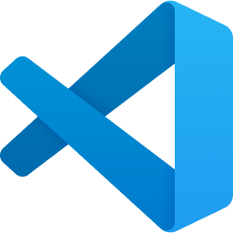
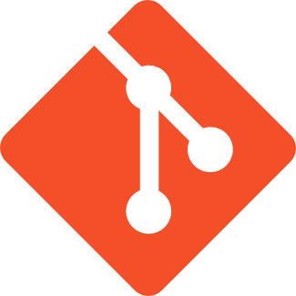
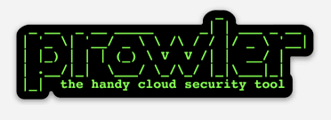
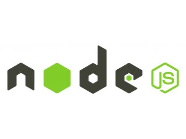
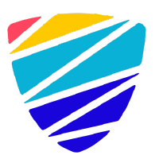
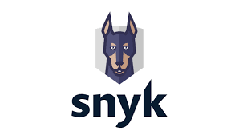
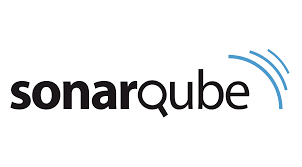
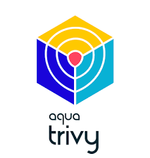
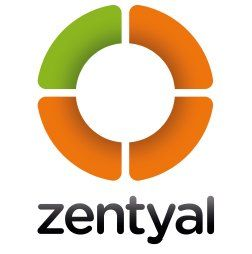
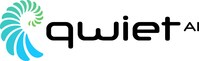

# Herramientas - DevSecOps

En el siguiente conjunto de enlaces se relacionan las diferentes herramientas que van a ser usadas en los diferentes laboratorios para el desarrollo de las actividades.

| Nombre | Sitio Web | Logo |
| --- | --- | --- |
| Azure | <https://portal.azure.com/> | 

 |
| Visual Studio Code | <https://code.visualstudio.com/download> | 

 |
| GIT for Windows | <https://gitforwindows.org/> | 

 |
| Prowler | <https://github.com/prowler-cloud/prowler> | 

 |
| node.js| <https://nodejs.org/en> | 

 |
| CloudSploit | <https://github.com/aquasecurity/cloudsploit> | 

 |
| Snyk | <https://app.snyk.io/login> | 

 |
| Sonarcloud | <https://sonarcloud.io/login> | 

 |
| Trivy | <https://trivy.dev/> | 

 |
| Mend | <https://www.mend.io/> | 

 |
| Checkov | <https://www.checkov.io/> | 

 |
| TailScale | <https://tailscale.com/> | 

 |
| OWASP ZAP |  <https://www.zaproxy.org/> | 

 |
| Zentyal | <https://www.zentyal.com/> | 

 |
| Qwiet.ai | <https://qwiet.ai/> | 

 |
| Microsoft Defender for Cloud | <https://learn.microsoft.com/en-us/azure/defender-for-cloud/> | 

 |
| OWASP Threat Dragon | <https://owasp.org/www-project-threat-dragon/> | 

 |